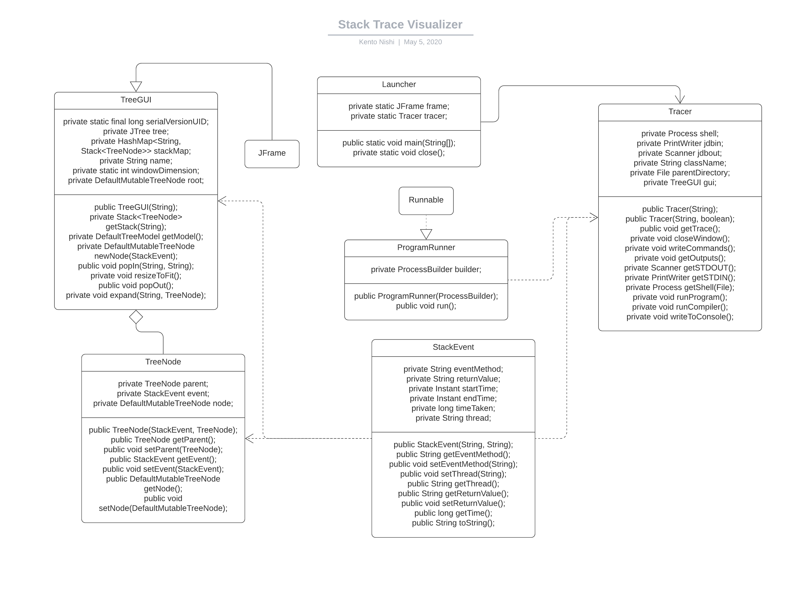

# Preliminary Specification

## Classes

| Class | Description |
|:----|:----|
| `Launcher` | Contains the `main` method that runs the program. |
| `Tracer` | The class that communicates with the debugger and generates the stack trace. |
| `TreeGUI` | The graphical user interface that displays the stack tree. |
| `StackEvent` | A data carrier class that holds stack event data. |
| `TreeNode` | A data carrier class that holds tree node data. |

## Methods
### Launcher

| Method | Description |
|:----|:----|
| `public static void main` | Runs the tracer. |
| `private static void close` | Closes the tracer. |

### Tracer

| Method | Description |
|:----|:----|
| `public Tracer` | The class constructor. |
| `private void getTrace` | Starts the stack tracing. |
| `public void closeWindow` | Sends a request to close the tree GUI. |
| `private void writeCommands` | Sends a list of commands to JDB. |
| `private void getOutputs` | Reads the output from JDB. |
| `private Scanner getSTDOUT` | Creates a Scanner linked to JDB's STDOUT. |
| `private Process getShell` | Returns the JDB process. |
| `private void runProgram` | Runs a Java program using the tracer. |
| `private void runCompiler` | Runs the Java compiler on all files in the specified folder. |
| `private void writeToConsole` | Writes a single line to JDB's STDIN. |

### TreeGUI (extends JFrame)

| Method | Description |
|:----|:----|
| `public TreeGUI` | The class constructor. |
| `private DefaultTreeModel getModel` | Returns the tree model. |
| `private DefaultMutableTreeNode newNode` | Creates a new empty node to the tree. |
| `public void addNode` | Adds a new node to the tree. |
| `private void resizeToFit` | Resizes the window to fit the tree. |
| `private void popOut` | Creates a new popup. |

## Class Diagram

