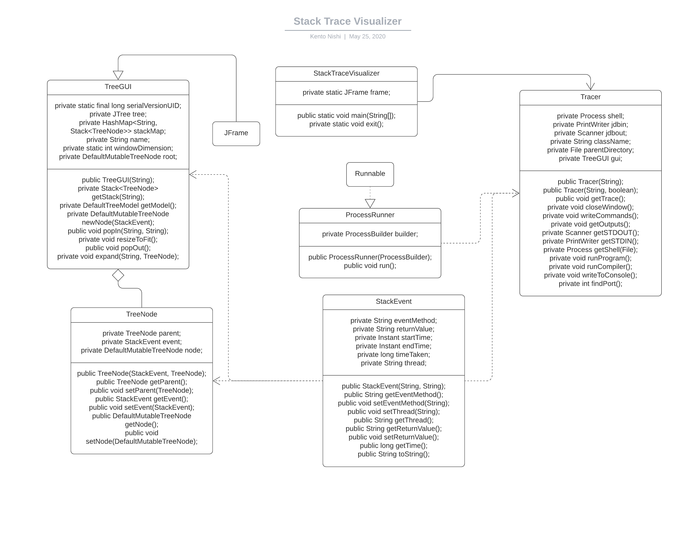

# Specification

## Classes

| Class | Description |
|:----|:----|
| [StackTraceVisualizer](#stacktracevisualizer) | Launches the tracer and graphical user interface. |
| [Tracer](#tracer) | Communicates with the debugger and generates the stack trace. |
| [TreeGUI](#treegui) | Opens the graphical user interface that displays the stack tree. |
| [StackEvent](#stackevent) | A data carrier class that holds stack event data. |
| [TreeNode](#treenode) | A data carrier class that holds tree node data. |
| [ProcessRunner](#processrunner) | A runnable container to run a process on a separate thread. |

## Methods
### StackTraceVisualizer

| Method | Description |
|:----|:----|
| `public static void main(String[])` | Runs the tracer. |
| `private static void exit()` | Exits the program. |

### Tracer

| Method | Description |
|:----|:----|
| `public Tracer(String)` | The Tracer constructor. |
| `public Tracer(String, boolean)` | The Tracer constructor with a compiler flag. |
| `public void closeWindow()` | Closes the TreeGUI window. |
| `private int findPort()` | Finds an open port. |
| `private void getOutputs()` | Gets the debugger output. |
| `private Process getShell(File file)` | Gets the shell process. |
| `private PrintWriter getSTDIN()` | Gets the STDIN of jdb. |
| `private Scanner getSTDOUT()` | Gets the STDOUT of jdb. |
| `private void runCompiler()` | Runs the compiler. |
| `private void runProgram()` | Runs the program. |
| `public void runTrace()` | Gets the stack trace. |
| `private void writeCommands(List<String> strs)` | Writes the specified command to the program. |
| `private void writeToConsole(String str)` | Writes a single line to the console. |

### TreeGUI (extends JFrame)

| Method | Description |
|:----|:----|
| `public TreeGUI(String)` | The TreeGUI constructor. |
| `private void expand(String thread, TreeNode parentNode)` | Expands a node on the graphical UI. |
| `private DefaultTreeModel getModel()` | Gets the model. |
| `private Stack<TreeNode> getStack(String thread)` | Gets the stack. |
| `private DefaultMutableTreeNode newNode(StackEvent event)` | Creates a new node. |
| `private void onSelected()` | The callback function that runs when a node is clicked. |
| `public void popIn(String method, String thread)` | Jumps a layer into the stack. |
| `public void popOut(String returnValue, String thread)` | Jumps out of a layer on the stack. |
| `private void resizeToFit()` | Resizes the window to fit. |

### StackEvent

| Method | Description |
|:----|:----|
| `public StackEvent(String, String)` | The StackEvent constructor. |
| `public String getEventMethod()` | Gets the event method name. |
| `public void setEventMethod(String)` | Sets the event method name. |
| `public String getThread()` | Gets the event thread name. |
| `public void setThread(String)` | Sets the event thread name. |
| `public String getReturnValue()` | Gets the event return value. |
| `public void setReturnValue(String)` | Sets the event return value. |
| `public long getTime()` | Gets the event execution time. |
| `public String toString()` | Returns a stringified version of the object. |

### TreeNode

| Method | Description |
|:----|:----|
| `public TreeNode(StackEvent, TreeNode, DefaultMutableTreeNode)` | The TreeNode constructor. |
| `public TreeNode getParent()` | Gets the parent node. |
| `public void setParent(TreeNode)` | Sets the parent node. |
| `public StackEvent getEvent()` | Gets the stack event. |
| `public void setEvent(StackEvent)` | Sets the node stack event. |
| `public DefaultMutableTreeNode getNode()` | Gets the current node. |
| `public void setNode(DefaultMutableTreeNode)` | Sets the current node. |

### ProcessRunner

| Method | Description |
|:----|:----|
| `public ProcessRunner(ProcessBuilder)` | The ProcessRunner constructor. |
| `public void run()` | Runs the process specified in the constructor. |

## Class Diagram

