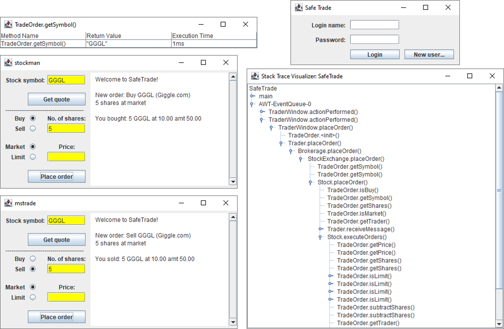

# Stack Trace Visualizer
An interactive graphical interface to visualize the Java call stack.

[Website](https://kentonishi.github.io/Stack-Trace-Visualizer/)

[Download JAR](https://github.com/kentonishi/Stack-Trace-Visualizer/releases/latest/download/StackTraceVisualizer.jar)

[Download ZIP](https://github.com/kentonishi/Stack-Trace-Visualizer/releases/latest/download/StackTraceVisualizer.zip)

[Documentation](https://kentonishi.github.io/Stack-Trace-Visualizer/docs)

[Development Logs](https://kentonishi.github.io/Stack-Trace-Visualizer/logs)



## Execution
1. Run the program. If the application you are trying to trace is a command line application, run the following command in your terminal:
    ```shell
    java -jar StackTraceVisualizer.jar
    ```
    Otherwise, you can launch the `.jar` executable like any other program.
1. A diaglog box will appear, prompting you for the full path to your program's `.class` file. 

    

    Make sure the path is a `.class` file. All `.java` files in the same parent directory as the specified `.class` file will be recompiled automatically.
1. A tracer screen will open, and the stack trace will be updated in real time. Execution may be significantly slower when using the tracer.

    


## Usage
1. Methods can be expanded by clicking the expand icon to the left of the method name.

    
    

1. Clicking on a method name opens a popup which displays more information about the method.

    
    

1. The stack trace window will update in real time.

    